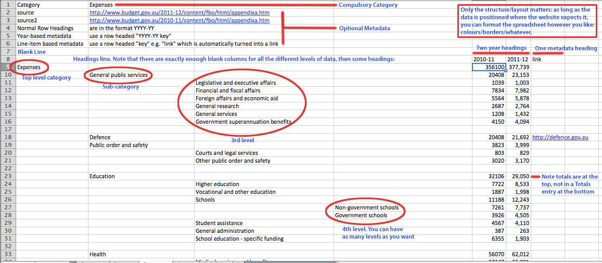

Excel spreadsheets are the primary way to load data into The Open Economy. The format is somewhat brittle. On the plus side, I'm guaranteeing backwards compatibility, so if you can successfully upload a spreadsheet to this version, it will continue to work.

Getting started
---------------

The easiest way to get started is to get an [example spreadsheet](#examples) and modify it. Check out the [annotated data sheet](#annotated_data_sheet) and [rules summary](#rules_summary) below if you're stuck. If that's still not enough, [get in touch](mailto:finvis@dja.id.au).

Rules summary
-------------

**Exactly one summary sheet.**

This must be the first sheet in the spreadsheet. Minimum of 3 rows, each with 2 columns.

* Name
* Type: `Aggregates` or `Item`
* Units

Any number of metadata rows can follow. Metadata rows take the format `key`, `value`, e.g. `source`, `http://www.budget.gov.au/2011-12/content/fbo/html/part_1.htm`.

**Data sheets**

There must be 1 (if Item), 2 or 4 (if Aggregates)

Rows go:
* `Category`: `Revenue`, `Expenditure`, `Assets`, or `Liabilites`.
* any number of metadata rows.
* a blank line
* A heading line: enough blank columns to fit all the nested categories, followed by column headers. (See the examples)
* Data, interspersed with blank lines as desired.

**Headers:**
* `YYYY-YY` is a value (where YYYY represents a four digit year and YY a two digit one). This format must be followed *precisely*.
* `YYYY-YY blah` is metadata with name 'blah' for the given year.
* `blah` is metadata with the name 'blah'.
* Year specific metadata overrides non-year-specific metadata. 

Populating the Info Box
-----------------------

The info box on the right hand side of the page is populated from the `info` metadata tag. You may provide a generic info column, and if you want things to change for an individual year, you can create a `YYYY-YY info` column, which will take precedence over the general info.

If you want a "More..." link at the bottom, add a `link` column. As with `info`, `YYYY-YY link` can be used to provide a year-specific link.

The Open Budget [example spreadsheet](#examples) is an example of how to do this.

Annotated Data Sheet
----------------------

Click to see the full image.

Examples
--------
 * [theopenbudget.org expense data.xls](http://vis.dja.id.au/static/example-data/theopenbudget.org%20expense%20data.xls)
 * [transportandcoms.xls](http://vis.dja.id.au/static/example-data/transportandcoms.xls)
 * [cth-fbo.xls](http://vis.dja.id.au/static/example-data/cth-fbo.xls)
